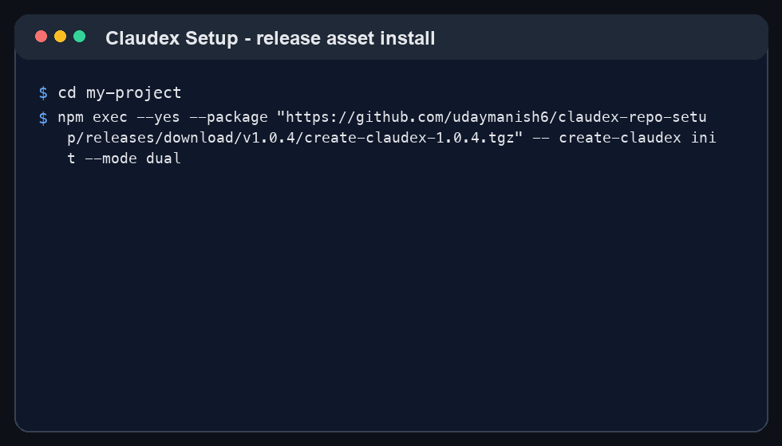
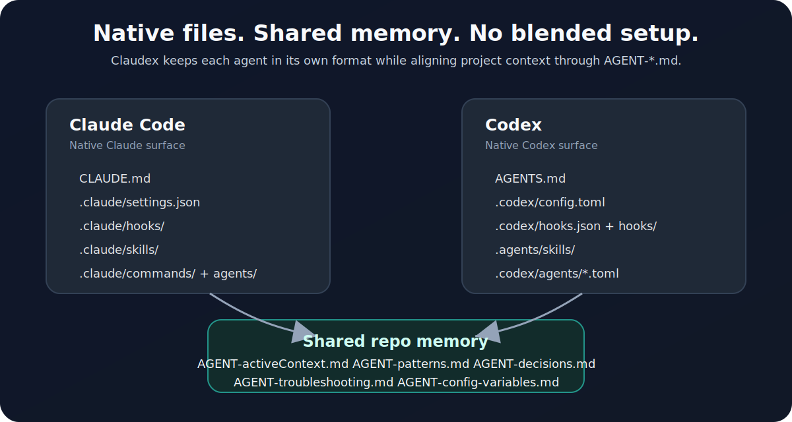
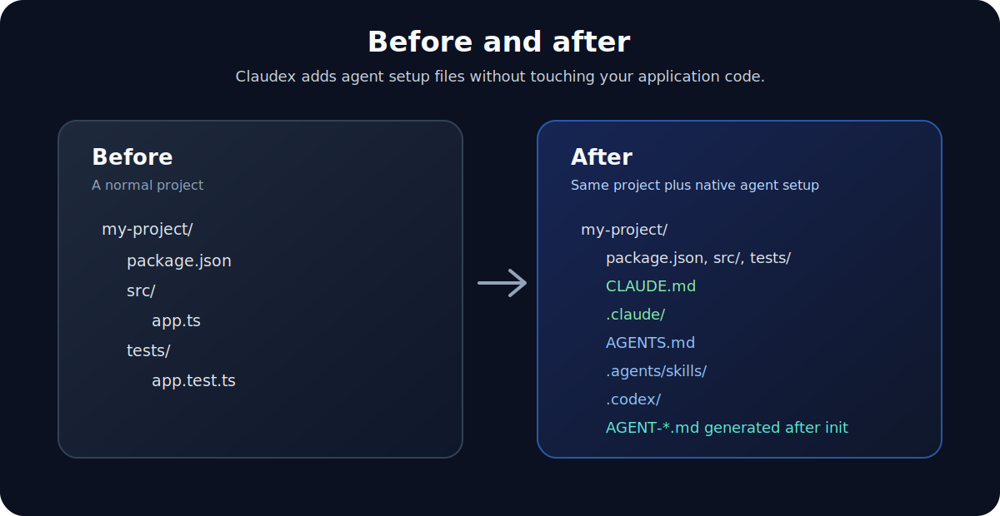

# Claudex Setup

> Claude Code and Codex project setup that stays native, shared, and hard to drift.

[](https://github.com/udaymanish6/claudex-repo-setup/releases/tag/v1.0.2)
[](https://github.com/udaymanish6/claudex-repo-setup/releases)
[](#verify-the-package)
[](https://nodejs.org/)
[](LICENSE)
[](https://code.claude.com/)
[](https://openai.com/codex/)

Claudex gives any repo a clean AI-agent setup in one command. Use Claude Code, Codex, or both without hand-building instruction files, hooks, skills, agents, and memory rules every time.

```bash
npm exec --yes --package "github:udaymanish6/claudex-repo-setup#v1.0.2" -- create-claudex init --mode dual
```

Use it when you want:

- Claude Code to keep using `CLAUDE.md` and `.claude/`.
- Codex to keep using `AGENTS.md`, `.codex/`, and `.agents/`.
- Both agents to share the same repo-visible project memory.
- Hooks, skills, commands, and agents to start from a sane template instead of drifting by hand.

## See It







## Why This Exists

AI coding tools are useful until each one learns a different version of the project.

Claude has one setup shape. Codex has another. If you use both, rules get duplicated, hooks go stale, memory hides in local state, and migrations become messy.

Claudex solves that by keeping each tool native while giving them one shared project contract:

```text
AGENT-activeContext.md
AGENT-patterns.md
AGENT-decisions.md
AGENT-troubleshooting.md
AGENT-config-variables.md
```

Those files are generated inside the target project from the target project's real code and state. They are not pre-filled boilerplate.

## Quick Start

Install the dual Claude + Codex setup into the current project:

```bash
cd /path/to/project
npm exec --yes --package "github:udaymanish6/claudex-repo-setup#v1.0.2" -- create-claudex init --mode dual
```

Check the installed setup:

```bash
npm exec --yes --package "github:udaymanish6/claudex-repo-setup#v1.0.2" -- create-claudex check --mode dual --target .
```

Start your agent:

```bash
claude   # for Claude Code
codex    # for Codex
```

Then initialize project memory from the real project state:

- In Claude Code: run `/init`, then use `/update-memory-bank` after meaningful work.
- In Codex: use the `update-memory-bank` skill, or ask Codex to initialize the memory bank.

Claudex is currently installed from the GitHub release tag. The npm registry package is not published yet.

## Pick A Mode

| Mode | GitHub release command | Installs | Use when |
|---|---|---|---|
| Claude only | `npm exec --yes --package "github:udaymanish6/claudex-repo-setup#v1.0.2" -- create-claudex init --mode claude` | `CLAUDE.md`, `.claude/` | The project will use Claude Code only. |
| Codex only | `npm exec --yes --package "github:udaymanish6/claudex-repo-setup#v1.0.2" -- create-claudex init --mode codex` | `AGENTS.md`, `.agents/`, `.codex/` | The project will use Codex only. |
| Dual agent | `npm exec --yes --package "github:udaymanish6/claudex-repo-setup#v1.0.2" -- create-claudex init --mode dual` | Claude + Codex setup | You want both tools aligned in one repo. |

Install into another folder:

```bash
npm exec --yes --package "github:udaymanish6/claudex-repo-setup#v1.0.2" -- create-claudex init --mode dual --target /path/to/project
```

Skip the confirmation prompt in automation:

```bash
npm exec --yes --package "github:udaymanish6/claudex-repo-setup#v1.0.2" -- create-claudex init --mode dual --target /path/to/project --yes
```

`--yes` does not force overwrite. It only skips the prompt.

## What Gets Added

```text
CLAUDE.md                  # Claude Code project instructions
.claude/                   # Claude settings, hooks, skills, commands, agents, rules

AGENTS.md                  # Codex project instructions
.agents/skills/            # Repo-local Codex skills
.codex/                    # Codex config, hooks, agents, rules
```

The reusable template folders are:

```text
templates/claude-only/     # Claude-native setup
templates/codex-only/      # Codex-native setup
templates/dual/            # Both setups together
migration/                 # One-agent-to-the-other migration guides
```

Generated memory files are intentionally not shipped in the template. The target project creates them after the agent inspects real code.

## Native, Not Blended

Claudex does not pretend Claude and Codex are the same tool.

| Purpose | Claude Code | Codex |
|---|---|---|
| Main repo instructions | `CLAUDE.md` | `AGENTS.md` |
| Config | `.claude/settings.json` | `.codex/config.toml` |
| Hook config | `.claude/settings.json` hooks | `.codex/hooks.json` |
| Hook scripts | `.claude/hooks/` | `.codex/hooks/` |
| Skills | `.claude/skills/` | `.agents/skills/` |
| Slash commands | `.claude/commands/` | Mirrored as Codex skills when portable |
| Subagents | `.claude/agents/*.md` | `.codex/agents/*.toml` |
| Shared project memory | `AGENT-*.md` | `AGENT-*.md` |

That is why the raw folder counts are different. Claude has skills plus slash commands. Codex gets the portable command workflows as skills because that is the native reusable workflow surface in this template.

Current dual template shape:

```text
Claude: 8 skills + reusable slash commands + agents + hooks
Codex:  21 skills, including mirrored Claude command workflows + agents + hooks
```

## Included Workflows

Claudex includes a practical starter set instead of only empty instruction files.

Shared concepts:

- Code search and repo exploration.
- Memory-bank synchronization.
- UX/design review support.
- Setup verification.
- Memory update workflows.
- Terminal completion notification hooks.

Claude-native additions:

- Claude docs consultant.
- Consult Codex workflow.
- Claude slash commands for cleanup, refactor, security, documentation, prompt engineering, architecture, and memory updates.
- Session metrics and audit helpers.

Codex-native additions:

- Codex docs consultant.
- Consult Claude workflow.
- Codex skill mirrors for portable Claude command workflows.
- Codex hook guard for memory review before stop/compact.

## Shared Memory Bank

The generated `AGENT-*.md` files are the repo-visible memory layer both agents can use.

| File | What it remembers | Read when | Update when |
|---|---|---|---|
| `AGENT-activeContext.md` | Current goal, recent work, blockers, next steps | Session start/resume, before finalizing | Meaningful work changes project state |
| `AGENT-patterns.md` | Reusable implementation, testing, and workflow patterns | Before coding/refactoring | A repeated pattern is found or changed |
| `AGENT-decisions.md` | Durable technical decisions and tradeoffs | Before design choices | A lasting decision is made or superseded |
| `AGENT-troubleshooting.md` | Known failures, fixes, commands, prevention notes | During debugging | A problem is diagnosed and fixed |
| `AGENT-config-variables.md` | Env vars, config, hooks, MCP, safe examples | When touching settings/config/deploy | Config shape or meaning changes |

Claude can also use repo-local native memory under `memory/` when initialized. Codex native memories under `~/.codex/memories/` remain local recall. The shared contract is still `AGENT-*.md`.

## Safety Rules

The initializer is conservative by design.

It refuses to overwrite these existing paths:

```text
CLAUDE.md
AGENTS.md
.claude/
.codex/
.agents/
```

For an existing project, do not blindly replace agent files. Use the migration guides and keep the old setup until you decide what to remove.

## Migration

Started with Claude and want Codex too?

```text
migration/claude-to-codex.md
```

Started with Codex and want Claude too?

```text
migration/codex-to-claude.md
```

The migration rule is simple:

1. Add the second agent setup in parallel.
2. Preserve the existing setup first.
3. Mirror shared memory, hooks, agents, and workflows where useful.
4. End with a user decision: keep both agents or remove the old one.

## Verify The Package

For maintainers:

```bash
npm test
npm run check
npm pack --dry-run
```

What the checks cover:

- CLI usage and version output.
- Claude-only, Codex-only, and dual installs.
- Refusal to overwrite existing setup files.
- Template parity between standalone and dual modes.
- Codex mirrors for portable Claude workflows.
- Agent-specific docs consultants.
- Shared `AGENT-*.md` memory rules.
- Hook command project-root fallback.
- No generated memory files shipped in templates.

Recent smoke coverage also verified:

- Packed local package tarball installation into a fresh project.
- Installed `create-claudex` and `claudex-init` binaries.
- Generated JSON, TOML, and Python syntax.
- Codex runtime loading `AGENTS.md`.
- Codex runtime discovering repo-local `.agents/skills/`.
- Live Codex `update-memory-bank` skill updating generated `AGENT-*.md` files.

Claude CLI was not available in that smoke environment, so Claude runtime launch was not claimed; Claude files and hooks were validated directly.

## Release Status

Current GitHub release: `v1.0.2`.

This is the initial public release of the clean Claude Code + Codex setup template. Until the npm registry package is published, install through the GitHub release tag:

```bash
npm exec --yes --package "github:udaymanish6/claudex-repo-setup#v1.0.2" -- create-claudex --help
```

## Credits

Claudex builds on ideas from the Claude Code and Codex communities: repo-local instructions, explicit memory banks, agent skills, hooks, and migration-friendly setup files.

Special thanks to George Liu / Centmin Mod's Claude Code setup work:

- https://github.com/centminmod/my-claude-code-setup

The Claude memory-bank direction is especially influenced by the Centmin Mod setup's `/init` and project-memory workflow. Claudex packages that direction into a dependency-free initializer that keeps Claude and Codex native instead of merging them into one brittle format.

## License

MIT
